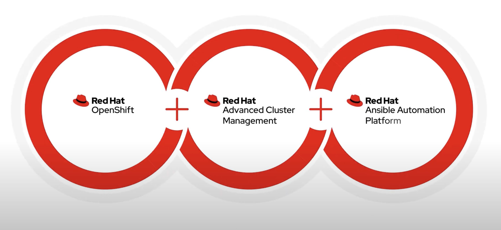
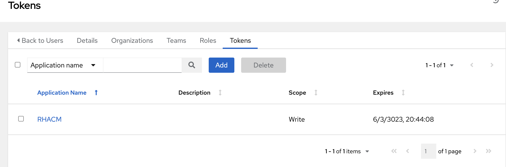
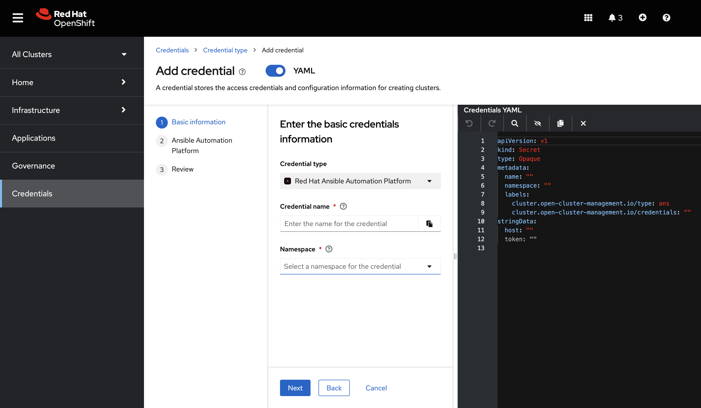

# Red Hat Advanced Cluster Management policies automation with Red Hat Ansible Automation Platform




## Overview

This document provides a step-by-step guide to integrate Ansible Automation Platform (AAP) into Red Hat Advanced Cluster Management (RHACM). RHACM is an Openshift advanced cluster management solution that enables you to centrally manage and orchestrate clusters. AAP is an automation platform that simplifies the management and deployment of automation tasks through the use of Ansible playbooks.

The integration of AAP into RHACM is designed to automatically resolve policies violations defined on RHACM. When a policy on RHACM is in violation, AAP playbooks are activated to resolve the problem associated with the policy violation.


The goal of this scenario is the automatic troubleshooting of ManagedClusters, in this use-case we will focus in particular on the integration of the two components and the authentication of AAP towards ManagedClusters, using the features of  ManagedServiceAccount (tech-preview) and ClusterProxy of RHACM.

The Ansible Automation Platform can also be external to the RHACM-related HUB cluster. However, the basic requirement is to install the Ansible Automation Platform Operator, so that the integration can be managed.

## Use Case 
- Installation Operators with Manual mode
- Delete Jobs in Failed
- Upgrade Managed Cluster with Health Check Playbook as PreHook

## Prerequisites

- RHACM installed and configured. (Bootstrap Example)
- AAP Operator installed and configured.
- Enable [ManagedServiceAccount-preview](https://access.redhat.com/documentation/en-us/red_hat_advanced_cluster_management_for_kubernetes/2.8/html/install/installing#serviceaccount-addon-intro)

## Step

1. RedHat Advanced Cluster Management installation

    1.1 Installing from the OpenShift Container Platform Console 

        Select Operators -> OperatorHub to access the list of available operators and select Advanced Cluster Management for Kubernetes operator.

        On the Operator subscription page, select the options for your installation:

        Namespace information:

        The Red Hat Advanced Cluster Management hub cluster must be installed in its own namespace or project.
        By default, the OperatorHub console installation process creates a namespace titled open-cluster-management. Best practice: Continue to use the open-cluster-management namespace if it is available.
        If there is already a namespace named open-cluster-management, choose a different namespace.
        Channel: The channel that you select corresponds to the release that you are installing. 
        Approval strategy for updates: The approval strategy identifies the human interaction required for applying updates to the channel or release to which you subscribed.

        Select "Automatic" to ensure all the updates within that release are automatically installed.
        Select "Manual" to receive a notification when an update is available. If you want to have the control of all the installed updates this might be best practice for you.
        
        Select "Install" to apply your changes and create the operator.
        Create the MultiClusterHub custom resource.

        In the OpenShift Container Platform console navigation select "Installed Operators" > Advanced Cluster Management for Kubernetes.
        Select the "MultiClusterHub" tab.
        Select "Create MultiClusterHub".
        Update the default values in the YAML file. See options in the MultiClusterHub advanced configuration section of the documentation.

        The following example shows the default template. Confirm that namespace is your project namespace. See the sample:

        ```yaml
        apiVersion: operator.open-cluster-management.io/v1
        kind: MultiClusterHub
        metadata:
        name: multiclusterhub
        namespace: <namespace>
        ```

        Select "Create" to initialize the custom resource. It can take up to 10 minutes for the Red Hat Advanced Cluster Management hub cluster to build and start.

    1.2 Installing from the OpenShift Container Platform CLI
        
        For convenience, all installation files are located in the bootstrap folder.

        - Create Namespace
            ```yaml
            apiVersion: v1
            kind: Namespace
            metadata:
            name: open-cluster-management        
            ```
        - Create Subscription and OperatorGroup
            ```yaml
            apiVersion: operators.coreos.com/v1
            kind: OperatorGroup
            metadata:
            name: open-cluster-management
            namespace: open-cluster-management
            spec:
            targetNamespaces:
            - open-cluster-management  
            ---
            apiVersion: operators.coreos.com/v1alpha1
            kind: Subscription
            metadata:
            name: advanced-cluster-management
            namespace: open-cluster-management
            spec:
            channel: release-2.8
            installPlanApproval: Automatic
            name: advanced-cluster-management
            source: redhat-operators
            sourceNamespace: openshift-marketplace      
            ```     
        - Create MultiClusterHub
            ```yaml
            apiVersion: operator.open-cluster-management.io/v1
            kind: MultiClusterHub
            metadata:
            name: multiclusterhub
            namespace: open-cluster-management
            spec: {}         
            ```              

2. Ansible Automation Platform Operator installation

Ensure that Ansible Automation Platform is correctly installed and configured. Check that the playbooks required for integration are present and functioning.

    2.1 Installing from the OpenShift Container Platform Console 

        - Select "Operators" -> OperatorHub to access the list of available operators and select Ansible Automation Platform operator and click "Install".

        - Select an Update Channel:

            **stable-2.x**: installs a namespace-scoped operator, which limits deployments of automation hub and automation controller instances to the namespace the operator is installed in. This is suitable for most cases. The stable-2.x channel does not require administrator privileges and utilizes fewer resources because it only monitors a single namespace.

            **stable-2.x-cluster-scoped**: deploys automation hub and automation controller across multiple namespaces in the cluster and requires administrator privileges for all namespaces in the cluster.

        - Select "Installation Mode", "Installed Namespace" and "Approval Strategy".
        
        - Click "Install".

    1.2 Installing from the OpenShift Container Platform CLI
        
        For convenience, all installation files are located in the bootstrap folder.

        - Create Namespace
            ```yaml
            apiVersion: v1
            kind: Namespace
            metadata:
            annotations: {}
            name: aap
            spec: {}      
            ```
        - Create Subscription and OperatorGroup
            ```yaml
            apiVersion: operators.coreos.com/v1
            kind: OperatorGroup
            metadata:
            name: ansible-automation-platform
            namespace: aap
            spec:
            targetNamespaces:
                - aap 
            ---
            apiVersion: operators.coreos.com/v1alpha1
            kind: Subscription
            metadata:
            name: ansible-automation-platform-operator
            namespace: ansible-automation-platform
            spec:
            channel: stable-2.4
            installPlanApproval: Automatic
            name: ansible-automation-platform-operator
            source: redhat-operators
            sourceNamespace: openshift-marketplace    
            ```     

If you have not installed Ansible Automation Controller yet, you can follow the relevant [documentation](https://access.redhat.com/documentation/en-us/red_hat_ansible_automation_platform/2.1/html/red_hat_ansible_automation_platform_operator_installation_guide/installing-controller-operator) to create an AAP Controller Instance.

3. Abilitating ManagedServiceAccount

RHACM allows the dynamic creation of ServiceAccounts on ManagedClusters. Make sure that this functionality is enabled on managed clusters.

```yaml
---
apiVersion: multicluster.openshift.io/v1
kind: MultiClusterEngine
metadata:
  name: multiclusterengine
spec:
  overrides:
    components:
    - name: managedserviceaccount-preview
      enabled: true
```

3. Configurating Cluster Proxy

RHACM uses Cluster Proxy to allow secure access to AAP-managed clusters. Configure Cluster Proxy to generate AAP-accessible URLs. For example:

https://cluster-proxy-user.apps.ClusterName.BaseDomain/ManagedClusterName

```yaml
apiVersion: multicluster.openshift.io/v1
kind: MultiClusterEngine
metadata:
  name: multiclusterengine
spec:
  availabilityConfig: High
  overrides:
    components:
...
      name: cluster-proxy-addon
    - enabled: true
      name: managedserviceaccount-preview
    - enabled: true
...
  targetNamespace: multicluster-engine
...
```

Retrieving the cluster user proxy url:

```bash
$ oc get route -n multicluster-engine cluster-proxy-addon-user
NAME                       HOST/PORT                                    SERVICES                   PORT  
cluster-proxy-addon-user   cluster-proxy-user.apps.ocp4.example.com     cluster-proxy-addon-user   user-port

```

4. Creating HUB ServiceAccount

It is useful to configure a serviceAccount on the RHACM HUB so that the playbooks on AAP can then create ManagedServiceAccounts and retrieve the token related to the ManagedServiceAccount. The ServiceAccount created on the hub has limited permissions.

```yaml
---
kind: ClusterRole
apiVersion: rbac.authorization.k8s.io/v1
metadata:
  name: aap-integration-serviceaccount-role
rules:
  - verbs:
      - get
      - list
      - watch
    apiGroups:
      - ''
    resources:
      - secrets
  - verbs:
      - get
      - list
      - watch
      - create
      - update
      - patch
      - delete
    apiGroups:
      - authentication.open-cluster-management.io
      - work.open-cluster-management.io
      - addon.open-cluster-management.io
    resources:
      - managedserviceaccounts
      - manifestworks
      - managedclusteraddons
      - managedserviceaccounts/finalizers
      - manifestworks/finalizers
      - managedclusteraddons/finalizers
---
kind: ClusterRoleBinding
apiVersion: rbac.authorization.k8s.io/v1
metadata:
  name: token-reader-sa-aap
subjects:
  - kind: ServiceAccount
    name: aap-integration-serviceaccount
    namespace: aap
roleRef:
  apiGroup: rbac.authorization.k8s.io
  kind: ClusterRole
  name: aap-integration-serviceaccount-role
---
kind: ServiceAccount
apiVersion: v1
metadata:
  name: aap-integration-serviceaccount
  namespace: aap
---
kind: Secret
apiVersion: v1
metadata:
  name: secret-sa-long-lived
  namespace: aap
  annotations:
    kubernetes.io/service-account.name: aap-integration-serviceaccount
type: kubernetes.io/service-account-token
```
Obtaining the token:

```bash
oc get secret -n aap secret-sa-long-lived -o json | jq .data.token | base64 -d
```

5. Creating an ansible vault

The ansible vault will contain the token related to the hub and the route related to the proxy cluster.

```bash
mkdir vault
vi vault/vault.yaml
```
```yaml
hub_url: https://cluster-proxy-user.apps.ocp4.example.com  
token_acm: yJhbGciOiJSUzI1NXXXXXXXXXXXXXXXXXXXX
```
```bash
ansible-vault encrypt vault/vault.yaml
```

6. AAP Integration

- Creating tokens in the Ansible automation platform\
  Users -> SelectedUsers -> Tokens



- creation of a new credential in RHACM\
  multicloud Dashboard -> Credentials -> AAP Crendetials Type



```yaml
---
apiVersion: v1
kind: Secret
type: Opaque
metadata:
  name: aap-integration
  namespace: aap
  labels:
    cluster.open-cluster-management.io/credentials: ""
    cluster.open-cluster-management.io/type: ans
stringData:
  host: https://<AAP Url>
  token: "<AAP Token>"
```

7. Checking (Revising)

Perform integration by running AAP playbooks through the configured Automation Policy. Verify that automation actions are executed correctly and that AAP can communicate with managed clusters through Cluster Proxy.


## Troubleshooting

If problems occur, check the AAP and RHACM logs to identify any errors.
Ensure that playbooks are properly configured and credentials are valid.

## Notes

Be sure to follow security best practices when setting up integration between AAP and RHACM.
Check the official documentation of AAP and RHACM for any updates or changes in procedures.